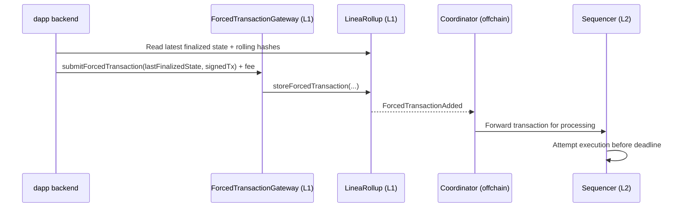

Forced transactions are an L1-backed fallback path for Linea transactions.

For most products, the normal L2 submission path should remain the default. Forced transactions are
best used as a resilience layer for high-value or high-risk flows.

## Understand forced transactions

A forced transaction lets a user submit a signed L2 transaction through L1, with a requirement that
the sequencer processes it by a deadline.

This helps protect users when normal inclusion is delayed or blocked.

:::warning Understand the guarantee model
Forced transactions guarantee processing by a deadline, not successful execution.

A transaction can be processed but still fail on L2 because of nonce conflicts, insufficient
balance, gas issues, or contract revert logic.
:::

## Decide why your app should enable this

Builders usually enable forced transactions for one or more product goals:

- improve liveness for critical user actions
- reduce censorship risk for sensitive operations
- provide a transparent fallback under degraded network conditions
- increase trust for high-value workflows

Typical protected flows include:

- withdrawal requests and claims
- liquidation and risk-management actions
- governance operations with strict timing
- emergency controls and safety operations

## Choose where forced fallback belongs in UX

Keep the standard path first, and reserve forced transactions for explicit fallback scenarios.

| Path | Product role | Expected trade-off |
|---|---|---|
| Normal L2 submission | Fast default UX | No deadline-backed processing guarantee |
| Forced submission via L1 | Fallback for critical actions | Extra L1 fee and more complexity |

Recommended UX pattern:

1. Submit normally on L2.
2. Watch for inclusion and confirmations.
3. Offer "Use forced transaction" if policy conditions are met.
4. Explain the guarantee clearly before user confirmation.

Trigger examples for showing fallback:

- the transaction remains pending beyond your configured threshold
- the user is executing a critical operation category
- your backend health checks detect degraded sequencer behavior

## Implement a practical fallback policy

A simple production policy can look like this:

- define critical action types in your product
- define timeout thresholds by action type
- require an explicit user confirmation for forced mode
- log all forced submissions for support and analytics

```typescript
if (isCriticalAction(action) && isPendingTooLong(tx, thresholdMs)) {
  showForcedTxCTA({
    reason: "Transaction pending beyond policy threshold",
    userImpact: "Higher fee, stronger processing guarantee",
  });
}
```

## Implement the forced path

At minimum, your integration should:

1. Collect the latest finalized state from `LineaRollup`.
2. Build the required `LastFinalizedState` payload.
3. Submit the signed transaction and fee to `ForcedTransactionGateway`.
4. Monitor processing status through your indexer or event pipeline.



## Explain guarantees clearly to users

When users opt into forced mode, communicate:

- what is guaranteed: processing attempt by deadline
- what is not guaranteed: successful execution
- what changes for users: extra L1 fee and longer operational path

This avoids support confusion and aligns expectations with protocol behavior.

## Track operations with the right metrics

Track at least:

- forced fallback offer rate
- forced submission acceptance rate
- time to processing after forced submission
- execution success vs execution failure rate
- support tickets linked to forced flow copy or UX

These metrics help you tune policy thresholds and improve conversion.

## Launch with guardrails

Before broad release:

1. Start with one high-value flow.
2. Use a conservative pending-time threshold.
3. Add clear copy for guarantees and fees.
4. Run a staged release with observability alerts.

## Continue reading

- Technical architecture:
  [Forced transactions](../../protocol/architecture/forced-transactions.mdx)
- Finality and lifecycle:
  [Fast finality](../overview/known-finality-state.mdx)
- Contract addresses:
  [Contracts](./contracts.mdx)
