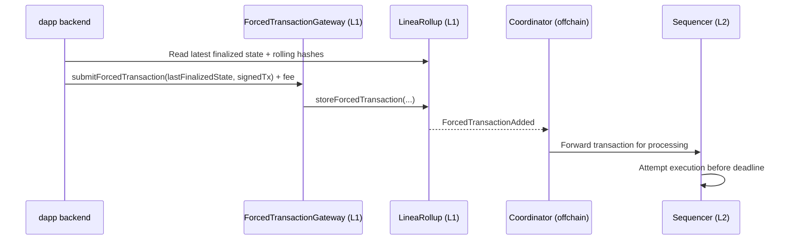

Forced transactions allow users to submit transactions directly to the Layer-1 (L1), Ethereum, that must be processed by the sequencer by a specific deadline. This system allows a processing guarantee that is enforced at finality. 

## Understand forced transactions

When a user submits a forced transaction, they submit a signed L2 transaction to the L1, with a requirement that the sequencer processes it by a specified block deadline. 

Typically, the sequencer will process the transaction well before the deadline -- the deadline is the **latest acceptable block, not the target block.** If the sequencer fails to meet the deadline, finalization will revert.

Forced transactions are an anti-censorhip mechanism that helps users submit transactions even when the normal L2 submission path is blocked or delayed.

:::warning [Transaction processing]
A forced transaction can be processed by the sequencer, but still fail on the L2 for reasons such as an invalid nonce, insufficient balance, low gas limit, or contract revert.
:::

For more information about how forced transactions work, see below.

## Use cases

Forced transactions support strong delivery gurantees and user trust for critical actions.

Some examples of ideal forced transaction use cases include:

- Withdrawal requests and claims
- Liquidation and risk-management actions
- Governance operations with strict timing
- Emergency controls and safety operations

## How forced transactions work

Forced transactions are chained using a MiMC-based rolling hash. The rolling hash commits to the complete ordered sequence of forced transactions, ensuring processing and storage. This mechanism prevents skipped forced transactions, unauthorized inserted transactions, and reordering attacks.

## Enable the forced path

Forced transactions is not enabled by default. To enable forced transactions,...

At minimum, your integration should:

1. Collect the latest finalized state from `LineaRollup`.
2. Build the required `LastFinalizedState` payload.
3. Submit the signed transaction and fee to `ForcedTransactionGateway`.
4. Monitor processing status through your indexer or event pipeline.

## Submit forced transactions