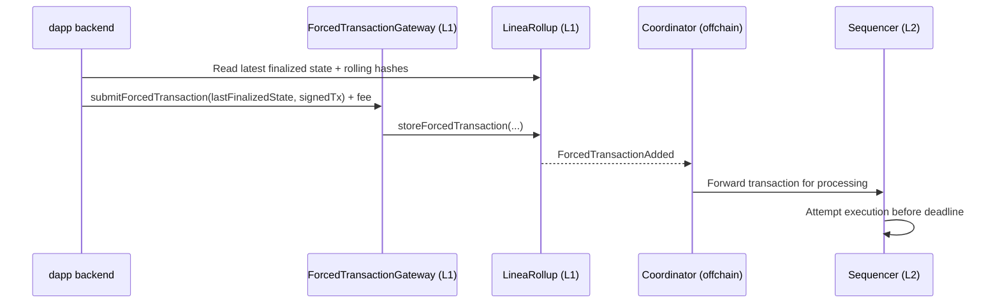

Forced transactions allow users to submit transactions directly to the Layer 1 (L1), Ethereum, that must be processed by the sequencer by a specific deadline. This system allows a processing guarantee that is enforced at finality. 

## Understand forced transactions

Forced transactions are an anti-censorhip mechanism that helps users submit transactions even when the normal L2 submission path is blocked or delayed.

When a user submits a forced transaction, they submit a signed L2 transaction to the L1, with a requirement that the sequencer processes it by a specified block deadline. 

Typically, the sequencer will process the transaction well before the deadline -- the deadline is the **latest acceptable block, not the target block**. If the sequencer fails to meet the deadline, finalization will revert.

Forced transactions are chained using a MiMC-based rolling hash. The rolling hash commits to the complete ordered sequence of forced transactions, ensuring processing and storage. This mechanism prevents skipped forced transactions, unauthorized inserted transactions, and reordering attacks.

:::warning Transaction processing
A forced transaction can be processed by the sequencer, but still fail on the L2 for reasons such as an invalid nonce, insufficient balance, low gas limit, or contract revert.
:::

For more information about how forced transactions work, see [below](#technical-components).

### Use cases

Forced transactions support strong delivery guarantees and user trust for critical actions.

Some examples of ideal forced transaction use cases include:

- Withdrawal requests and claims
- Liquidation and risk-management actions
- Governance operations with strict timing
- Emergency controls and safety operations

## Enable the forced path

Forced transactions is not enabled by default. To enable forced transactions on your smart contract,...

## Submit forced transactions

To submit a forced transaction, you first need to query the latest finalized state and rolling hashes from the L1.

Once you have the latest finalized state and rolling hashes, you can construct a transaction with the following fields:

- `timestamp`
- `messageNumber`
- `forcedTxNumber`
- `messageRollingHash`
- `forcedTxRollingHash`

Then, sign an EIP-1559 transaction destined for the L2:

```bash
struct Eip1559Transaction {
    uint256 nonce;
    uint256 maxPriorityFeePerGas;
    uint256 maxFeePerGas;
    uint256 gasLimit;
    address to;
    uint256 value;
    bytes input;
    AccessList[] accessList;
    uint8 yParity;
    uint256 r;
    uint256 s;
}
```

After submitting the transaction, the gateway will validate the transaction details.

## Technical components

When a user submits a forced transaction, the following components validate and process the transaction:

- `ForcedTransactionGateway`: Validates and submits the transaction to the Linea rollup.
- `LineaRollup`: Stores the transaction in the rollup and generates a rolling hash.
- Coordinator: Forwards the transaction to the sequencer for processing.
- Sequencer: Processes the transaction before the deadline.
- Prover: Generates a proof of the transaction and submits it to the finalization layer.


When a user submits a forced transaction to the `ForcedTransactionGateway`, the gateway calculates the deadline with a buffer, sets the maximum gas allowance, and submits the transaction to the `LineaRollup`.

The Linea rollup validates the current state of the chain, and stores the transaction in a queue of forced transactions, generating a rolling hash. The rollup also enforces processing by the deadline, and calculates the required fee for the forced transaction. At this stage, the transaction is also checked by the `AddressFilter` to ensure it is an allowed transaction type.

The transaction is then sent to the coordinator, an offchain component that forwards the transaction to the sequencer for processing.

The sequencer receives the transaction and must process it before the deadline. If the transaction is not processed before the deadline, the transaction is reverted and the user's funds are returned.

Once processed, the prover generates a proof of the transaction, computes the rolling hash, and submits the proof to the finalization layer.

The complete lifecycle of a forced transaction is as follows:



