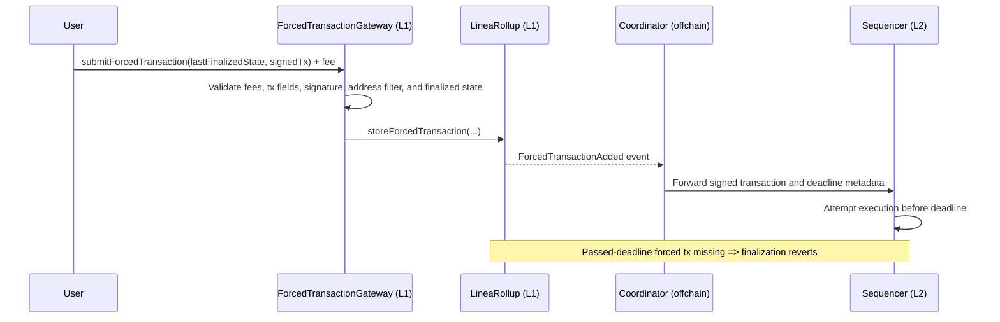

Forced transactions provide an L1-backed submission path for Linea transactions.

Instead of relying only on the public L2 mempool path, a user can submit a signed L2 transaction
to L1 through the forced transaction system. This gives a processing guarantee enforced at
finalization.

:::warning Processing guarantee
Forced transactions guarantee processing by a deadline, not successful execution.

The sequencer must attempt to execute the transaction before the deadline, but the transaction can
still fail on L2 for reasons such as invalid nonce, insufficient balance, low gas limit, or contract
revert.
:::

## Follow the submission flow

1. Sign an EIP-1559 transaction for Linea L2.
2. Fetch the latest finalized state fields from `LineaRollup`.
3. Submit the signed transaction and required fee to `ForcedTransactionGateway` on L1.
4. Let the coordinator forward the forced transaction event to the sequencer.
5. Confirm that processing occurred before the deadline.



## Build the finalized state payload

The gateway validates submissions against a `LastFinalizedState` struct.

Required fields:

- `timestamp`
- `messageNumber`
- `messageRollingHash`
- `forcedTransactionNumber`
- `forcedTransactionRollingHash`

Recommended retrieval flow:

1. Read the latest `FinalizedStateUpdated` event from `LineaRollup`.
2. Extract `timestamp`, `messageNumber`, and `forcedTransactionNumber`.
3. Query `rollingHashes(messageNumber)` for `messageRollingHash`.
4. Query `forcedTransactionRollingHashes(forcedTransactionNumber)` for the forced tx rolling hash.
5. Submit quickly so your state snapshot does not become stale.

```typescript
const events = await lineaRollup.queryFilter(lineaRollup.filters.FinalizedStateUpdated());
const latest = events[events.length - 1];

const { timestamp, messageNumber, forcedTransactionNumber } = latest.args;
const messageRollingHash = await lineaRollup.rollingHashes(messageNumber);
const forcedTransactionRollingHash = await lineaRollup.forcedTransactionRollingHashes(
  forcedTransactionNumber,
);

const lastFinalizedState = {
  timestamp,
  messageNumber,
  messageRollingHash,
  forcedTransactionNumber,
  forcedTransactionRollingHash,
};
```

## Understand deadline semantics

The system computes a `blockNumberDeadline` for each forced transaction.

This deadline is the latest acceptable L2 block by which the sequencer must process the transaction.
It is not a target block.

Operationally, this means:

- the sequencer can process the transaction at any earlier block
- processing after the deadline is too late
- finalization reverts when a passed-deadline forced transaction is missing

## Verify integrity and ordering

Forced transactions are chained using a MiMC-based rolling hash.

That rolling hash commits to an ordered sequence of forced transactions and is checked during
finalization proofs. This prevents:

- skipped forced transactions
- unauthorized inserted transactions
- reordering attacks

In practice, finalization enforces two guarantees:

- every forced transaction with a passed deadline has been processed
- the proven rolling hash matches the onchain rolling hash at the finalized forced tx number

## Reduce execution failure risk

A forced transaction can be processed and still fail to execute successfully.

Use this checklist before signing:

- refresh nonce just before signing
- estimate gas on Linea and add a safety buffer
- ensure enough L2 ETH for `value + gasLimit * maxFeePerGas`
- simulate calldata where possible
- submit promptly after reading finalized state

## Continue reading

- Review [Fast finality](../../network/overview/known-finality-state.mdx)
- Review [Coordinator](./coordinator.mdx) and [Sequencer](./sequencer/index.mdx)
- Check deployed contract addresses in [Contracts](../../network/build/contracts.mdx)
- See the source architecture spec on
  [GitHub](https://github.com/Consensys/linea-monorepo/blob/990f688e957632d27b3d9a86aec932a419041484/docs/forced-transactions-architecture.md#forced-transaction-submission-flow)
